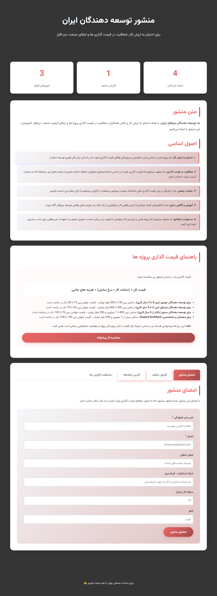
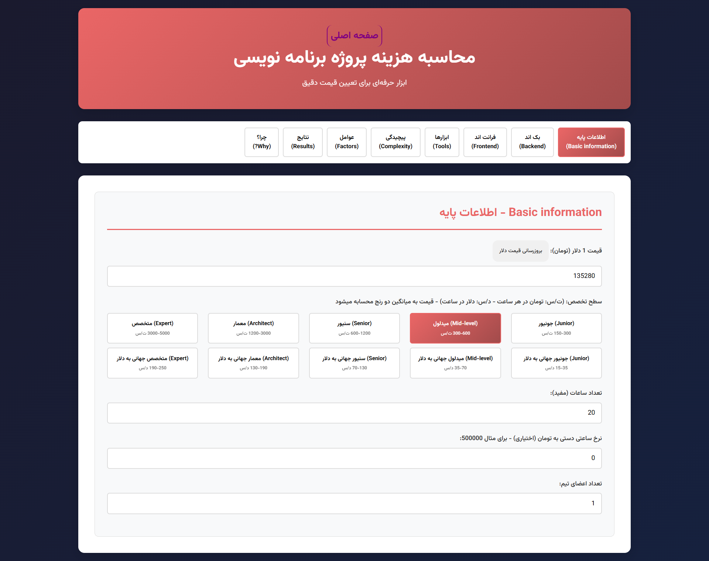
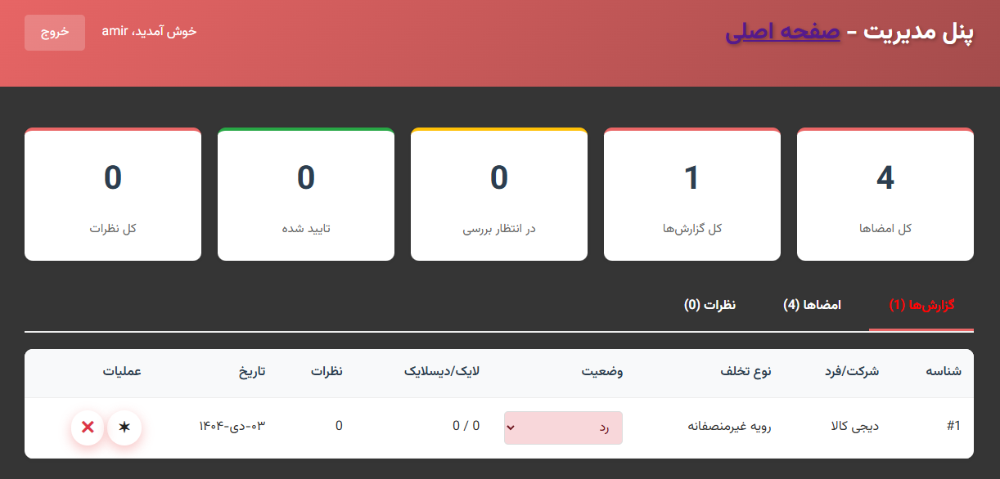

<div dir="rtl">

# 📜 منشور توسعه‌دهندگان نرم‌افزار ایران

[](https://opensource.org/licenses/MIT)
[](https://www.php.net/)
[](CONTRIBUTING.md)

**پلتفرمی برای احترام به ارزش کار، شفافیت در قیمت‌گذاری و ارتقای صنعت نرم‌افزار ایران**

[نسخه انگلیسی](README.md) | [مشاهده دمو](https://DevCharter.ir) | [گزارش باگ](https://github.com/amirroox/DeveloperCharterIran/issues)

---

## 🎯 درباره پروژه

منشور توسعه‌دهندگان ایران یک پلتفرم متن‌باز است که با هدف:

- 🤝 **احترام به ارزش کار**: تعیین استانداردهای منصفانه برای قیمت‌گذاری پروژه‌ها
- 💡 **شفافیت**: ایجاد راهنمای شفاف برای محاسبه هزینه پروژه‌های نرم‌افزاری
- 🛡️ **حمایت جمعی**: گزارش و پیگیری تخلفات قیمت‌گذاری غیرمنصفانه
- 📊 **آگاهی‌سازی**: آموزش کارفرمایان درباره ارزش واقعی توسعه نرم‌افزار

این پلتفرم به توسعه‌دهندگان و کارفرمایان کمک می‌کند تا با معیارهای شفاف و منصفانه‌ای همکاری کنند.

---

## ✨ ویژگی‌های اصلی

### 📝 سیستم امضای منشور
- ثبت اطلاعات توسعه‌دهندگان
- نمایش آمار لحظه‌ای امضاکنندگان
- پشتیبانی از تاریخ شمسی (جلالی)

### 🚨 سیستم گزارش تخلف
- گزارش موارد قیمت‌گذاری غیرمنصفانه
- طبقه‌بندی بر اساس نوع تخلف
- سیستم تأیید و بررسی گزارش‌ها
- حفظ حریم خصوصی گزارش‌دهندگان

### 💬 سیستم نظرات و واکنش‌ها
- امکان نظردهی روی گزارش‌ها
- سیستم لایک/دیسلایک
- کنترل Rate Limiting برای جلوگیری از اسپم

### 🧮 ماشین‌حساب پیشرفته قیمت‌گذاری
- محاسبه دقیق هزینه بر اساس:
  - سطح تخصص (جونیور تا متخصص)
  - تکنولوژی‌های استفاده شده (130+ تکنولوژی)
  - پیچیدگی معماری پروژه
  - عوامل افزایشی و کاهشی
- بروزرسانی خودکار نرخ دلار
- قیمت‌گذاری هم به تومان و هم به دلار
- مقایسه با استانداردهای جهانی

### 🔐 پنل مدیریت
- مدیریت امضاها و گزارش‌ها
- سیستم احراز هویت امن
- داشبورد آماری کامل
- مدیریت نظرات و واکنش‌ها

---

## 🚀 نصب و راه‌اندازی

### پیش‌نیازها

<div dir="ltr">

```bash
- PHP 7.4 یا بالاتر
- MySQL 5.7+ یا MariaDB 10.2+
- Apache/Nginx
- Composer (اختیاری)
```

</div>

### مراحل نصب

#### 1️⃣ کلون کردن پروژه

<div dir="ltr">

```bash
git clone https://github.com/yourusername/DeveloperCharterIran.git
cd DeveloperCharterIran
```

</div>

#### 2️⃣ تنظیمات دیتابیس

<div dir="ltr">

```bash
mysql -u root -p

CREATE DATABASE dev_manifesto CHARACTER SET utf8mb4 COLLATE utf8mb4_unicode_ci;

mysql -u root -p dev_manifesto < database.db
```

</div>

#### 3️⃣ تنظیمات PHP

<div dir="ltr">

```bash
# ویرایش فایل تنظیمات
nano api/config.php
```

```php
// تنظیمات دیتابیس
define('DB_HOST', 'localhost');
define('DB_USER', 'your_username');
define('DB_PASS', 'your_password');
define('DB_NAME', 'dev_manifesto');

define('URL', 'yourdomain.com');
```

</div>

#### 4️⃣ تنظیمات وب‌سرور

<div dir="ltr">

**Apache (.htaccess):**
```apache
RewriteEngine On
RewriteCond %{REQUEST_FILENAME} !-f
RewriteCond %{REQUEST_FILENAME} !-d
RewriteRule ^(.*)$ index.php [QSA,L]
```

**Nginx:**
```nginx
location / {
    try_files $uri $uri/ /index.php?$query_string;
}

location ~ \.php$ {
    fastcgi_pass unix:/var/run/php/php7.4-fpm.sock;
    fastcgi_index index.php;
    include fastcgi_params;
}
```

</div>

#### 5️⃣ تنظیم دسترسی‌ها

<div dir="ltr">

```bash
chmod 755 -R ./
chmod 777 calculator/cache.json
chown -R www-data:www-data ./
```

</div>

---

## 📁 ساختار پروژه

<div dir="ltr">

```
DeveloperCharterIran/
├── 📂 admin/                 # پنل مدیریت
│   ├── index.php            # داشبورد مدیریت
│   ├── login.php            # صفحه ورود
│   └── logout.php           # خروج از سیستم
│
├── 📂 api/                   # رابط های بک اند
│   ├── config.php           # تنظیمات اصلی
│   ├── sign.php             # ثبت امضا
│   ├── report.php           # ثبت گزارش
│   ├── comments.php         # مدیریت نظرات
│   ├── reactions.php        # لایک/دیسلایک
│   └── stats.php            # آمار و گزارش
│
├── 📂 assets/                # فایل‌های استاتیک
│   ├── style.css            # استایل اصلی
│   ├── calculator.css       # استایل ماشین‌حساب
│   ├── admin.css            # استایل پنل
│   ├── reports.css          # استایل گزارش‌ها
│   ├── script.js            # جاوااسکریپت اصلی
│   ├── calculator.js        # لاجیک ماشین‌حساب
│   └── reports.js           # لاجیک گزارش‌ها
│
├── 📂 calculator/            # ماشین‌حساب قیمت‌گذاری
│   ├── index.php            # صفحه اصلی
│   ├── cache.json           # کش نرخ ارز
│   └── update_rate.php      # بروزرسانی نرخ
│
├── 📂 helper/                # توابع کمکی
│   └── jdf.php              # تبدیل تاریخ جلالی
│
├── index.php                 # صفحه اصلی
├── reports.php               # لیست گزارش‌ها
├── database.db               # Schema دیتابیس
└── .gitignore               # فایل‌های نادیده گرفته شده
```

</div>

---

## 💻 استفاده

### امضای منشور
1. به صفحه اصلی بروید
2. تب "امضای منشور" را انتخاب کنید
3. اطلاعات خود را وارد کنید
4. روی "امضای منشور" کلیک کنید

### گزارش تخلف
1. تب "گزارش تخلف" را انتخاب کنید
2. نقش خود را مشخص کنید (کارفرما/پیمانکار)
3. اطلاعات متخلف و جزئیات را وارد کنید
4. گزارش را ارسال کنید

### محاسبه قیمت پروژه
1. به `/calculator` بروید
2. اطلاعات پایه را وارد کنید (ساعات کار، سطح تخصص)
3. تکنولوژی‌ها و ابزارهای مورد استفاده را انتخاب کنید
4. پیچیدگی و عوامل اضافی را مشخص کنید
5. قیمت پیشنهادی را مشاهده کنید

### ورود به پنل مدیریت

- URL: /admin
- نام کاربری پیش‌فرض: admin
- رمز عبور پیش‌فرض: admin123
- ⚠️ حتماً رمز عبور را بعد از اولین ورود تغییر دهید!

---

## 🤝 مشارکت در پروژه

ما از مشارکت شما استقبال می‌کنیم! 

### راه‌های مشارکت:
1. 🐛 **گزارش باگ**: از طریق [Issues](https://github.com/yourusername/DeveloperCharterIran/issues)
2. 💡 **پیشنهاد ویژگی جدید**: ایجاد Feature Request
3. 🔧 **ارسال Pull Request**: 
   - Fork کردن پروژه
   - ایجاد branch جدید (`git checkout -b feature/AmazingFeature`)
   - Commit کردن تغییرات (`git commit -m 'Add some AmazingFeature'`)
   - Push به branch (`git push origin feature/AmazingFeature`)
   - ایجاد Pull Request

---

## 📊 آمار پروژه

- 📝 خطوط کد: ~5,000+ خط
- 🗂️ فایل‌ها: 24 فایل
- 🔧 تکنولوژی‌ها: PHP, MySQL, JavaScript, CSS
- 📅 شروع پروژه: 2024
- 👥 مشارکت‌کنندگان: باز برای همه


---

## 📄 لایسنس

این پروژه تحت لایسنس MIT منتشر شده است - جزئیات را در فایل [LICENSE](LICENSE) مشاهده کنید.

```
MIT License - آزاد برای استفاده شخصی و تجاری
```

---

## 🙏 تشکر و قدردانی

- تیم توسعه‌دهندگان ایران که الهام‌بخش این پروژه بودند
- کتابخانه [jdf.php](http://jdf.scr.ir) برای تبدیل تاریخ جلالی
- جامعه متن‌باز ایران
- هوش مصنوعی! برای همین فایل!

---

## 📞 ارتباط با ما

- 🌐 وب‌سایت: [amirroox.ir](https://amirroox.ir)
- 📧 ایمیل: amirroox@yahoo.com
- 💬 تلگرام: [@you_113](https://t.me/you_113)

---

## 📸 اسکرین‌شات‌ها

### صفحه اصلی


### ماشین‌حساب قیمت‌گذاری


### پنل مدیریت


---

<div align="center">

**با ❤️ ساخته شده برای جامعه توسعه‌دهندگان ایران**

[⭐ ستاره بدید به این پروژه](https://github.com/yourusername/DeveloperCharterIran) اگر مفید بود!

</div>

</div>